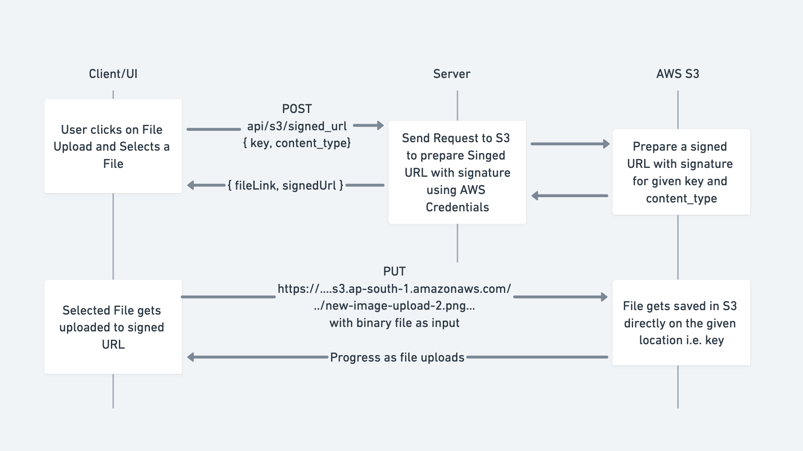

# Upload File to S3 using Signed URL

## Flow Diagram

## Keep in Mind

## Limiting File Uploads

- Creating Signed URL behind auth
- Rate limiting on creating Signed URLs with IP Address
- Specific key prefix format for each user/organization
  - public/assets/`<user_id>`/`<file_name>`
  - public/assets/`<user_id>`/avatar/`<file_name>`

## Maintaining Storage

- Uploading files with expiry date
  - Using S3 Lifecycle Rules
  - Using S3 Object Expiry
- Deleting unused files in S3 bucket when replaced with new files
